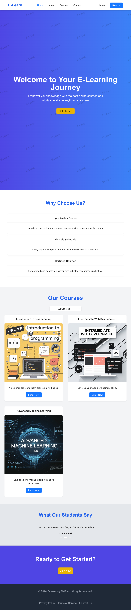
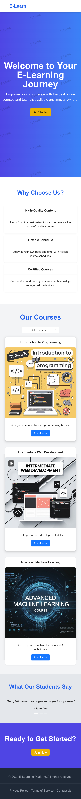

## Large Screen

## Tablet Screen

## Mobile Screen



# E-Learn Landing Page

## Table of Contents
- [E-Learn Landing Page](#e-learn-landing-page)
  - [Table of Contents](#table-of-contents)
  - [Overview](#overview)
  - [Features](#features)
  - [Technologies Used](#technologies-used)
  - [Getting Started](#getting-started)

## Overview
E-Learn is an online-based learning platform designed to empower knowledge through high-quality online courses and tutorials. This repository contains the landing page for the E-Learn platform, which serves as an introduction to our offerings and guides users to key sections of the site.

## Features
- **Responsive Design:** Mobile-friendly layout for seamless navigation across devices.
- **Dynamic Course Filtering:** Users can filter courses by skill level (All, Beginner, Intermediate, Advanced).
- **Testimonials Section:** Rotating testimonials to build credibility and trust.
- **Call to Action:** Encourages user engagement with prominent buttons.
- **Smooth Animations:** Enhancements to the user interface for a more engaging experience.

## Technologies Used
- **Next.js:** A React framework for building server-rendered and statically generated applications.
- **Ant Design:** A design system with a set of high-quality React components for building rich user interfaces.
- **Tailwind CSS:** A utility-first CSS framework for styling the application.
- **React:** JavaScript library for building user interfaces.

## Getting Started
To run this project locally, follow these steps:

1. **Clone the Repository:**
   ```bash
   git clone https://github.com/roman0190/landing_page.git
